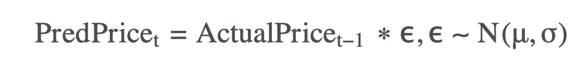

# Cryptocurrency Price Detector

## **1. Methodology**

## **2. Python Packages Required**

## **3. Dataset**
As we’ll be combining multiple cryptos in one model, it’s probably a good idea to pull the data from one source. We’ll use coinmarketcap.com. For now, we’ll only consider Bitcoin and Ether.

## **4. Training, Test & Random Walks**
In deep learning, the data is typically split into training and test sets. The model is built on the training set and subsequently evaluated on the unseen test set. In time series models, we generally train on one period of time and then test on another separate period.

Stock prices are commonly treated as random walks, which can be defined in these mathematical terms:

We’ll determine μ and σ from the training sets and apply the random walk model to the Bitcoin and Ethereum test sets.

## **5. Result and Error Analysis**
Like the random walk model, LSTM models can be sensitive to the choice of random seed (the model weights are initially randomly assigned).
The error will be calculated as the absolute difference between the actual and predicted closing prices changes in the test set.

## :clipboard: Contributor
Connect Here:  <a href = "https://www.linkedin.com/in/mishra-rahul07/" target="_blank">Rahul Mishra</a>
